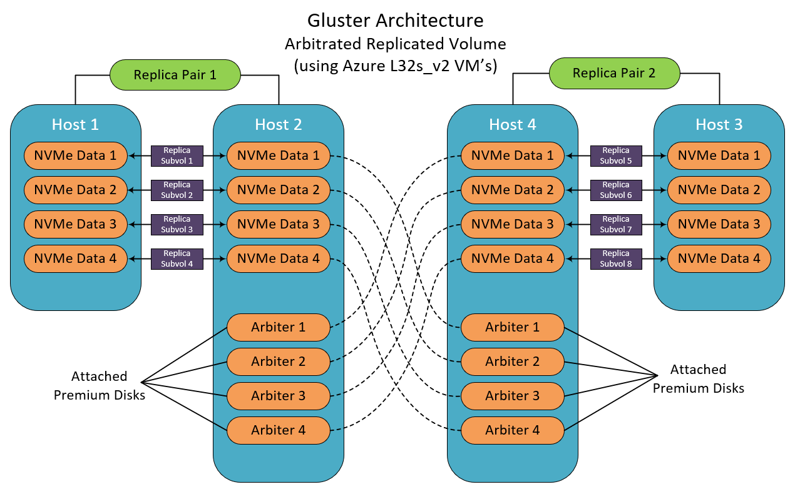

# Gluster File System
Automated deployment of gluster servers and clients

This template lets you create an N node Gluster File System on RHEL 7.5. It follows the Red Hat guidelines for a layered installation.  Because it uses the supported Red Hat VM instances, you will need to provide a UserID and Password for your Red Hat subscription.  You can provision 4, 8, or 12 nodes in an arbitrated-replicated cluster with a replication factor of 2. These machines will be placed into the same Availability Set.  There are no public IP addresses, so it must be installed onto an existing Virtual Network.  This template is specifically for the Ls_v2 series of VM's and uses the NVMe drives for the data bricks.  The number of drives will be determined by the VM size that you specify. 

The even numbered VM's will also have Premium disks attched to use as the arbiter bricks.  All of the bricks, both data and arbiter, are configured to consume the entire disk device.  This will keep the total number of bricks at a minimum while still providing the highest IOPS potential.

NFS is disabled, so all the clients must use the gluster native fuse client to access the file system.  This will enable automatic failover.  Please see the example of the mount command in the [gfsclient.sh](https://github.com/grandparoach/gluster/blob/LseriesEDA/gfsclient.sh) script for how to specify the backup servers.

This template will also provision a separate Machine for running the Gluster Web Administration tools.  When the deployment is complete, point your web browser to the public IP address of the GlusterWebAdmin VM.  When prompted for credentials, enter "admin" for the userID and "adminuser" for the password.   Then, click on the "Import" on the right edge of the screen.  Assign a name to the cluster and click "Import" at the bottom of the screen.  Then click "View Progress".  When the import is completed, click on "View cluster details" to launch the monitoring dashboard.

This link will deploy a cluster of client machines for testing the gluster servers performance.

